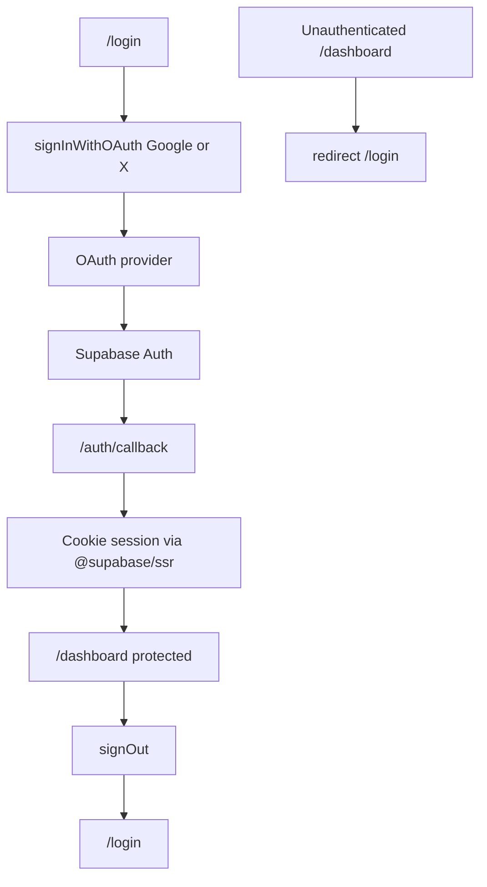

# Phase 1 Authentication — End-to-End Plan

## Current state

- Spec: [docs/PHASE_01_AUTHENTICATION.md](docs/PHASE_01_AUTHENTICATION.md)
- [frontend/](frontend/) exists but is empty (no `package.json`, no Next.js app)
- [backend/](backend/) has FastAPI folder layout + Alembic init only; `main.py` is empty
- No Supabase client code or env templates yet
- Auth source of truth: Supabase `auth.users` (no custom users table)

**Scope decision:** Phase 1 is **frontend-only authentication** via Supabase Auth. Backend JWT verification / FastAPI auth middleware is deferred (not required by the phase checklist). Keep backend untouched except optional notes in setup docs.

## Target flow



## Architecture choices (locked in)

| Choice | Decision |
|--------|----------|
| App location | `frontend/` |
| Next.js | App Router + TypeScript (latest stable `create-next-app`) |
| Supabase SDK | `@supabase/ssr` + `@supabase/supabase-js` (cookie sessions, SSR-safe) |
| Providers | `google` and `twitter` (X); no GitHub |
| Protection | `middleware.ts` + server-side session checks on protected layouts |
| Env vars | `NEXT_PUBLIC_SUPABASE_URL`, `NEXT_PUBLIC_SUPABASE_ANON_KEY` only on frontend |
| Users table | None — use `auth.getUser()` / session user metadata |

## Implementation workstream

### 1. Scaffold Next.js app
- Initialize Next.js (App Router, TypeScript, ESLint, Tailwind) inside [frontend/](frontend/)
- Confirm scripts: `dev`, `build`, `start`, `lint`
- Add root redirect: `/` → `/dashboard` if session else `/login`

### 2. Dependencies and env
- Install `@supabase/supabase-js` and `@supabase/ssr` only (no extra auth libs)
- Add [frontend/.env.local.example](frontend/.env.local.example) with:
  - `NEXT_PUBLIC_SUPABASE_URL`
  - `NEXT_PUBLIC_SUPABASE_ANON_KEY`
- Add [frontend/.env.local](frontend/.env.local) as local gitignored template for the developer to fill
- Ensure `.gitignore` covers `.env.local` (never commit secrets)

### 3. Supabase client layer
Create under `frontend/lib/supabase/`:
- `client.ts` — browser client (`createBrowserClient`)
- `server.ts` — server client (`createServerClient` + cookies)
- `middleware.ts` — session refresh helper for Next middleware

No service-role key anywhere in the frontend.

### 4. Auth middleware and route protection
- Add [frontend/middleware.ts](frontend/middleware.ts):
  - Refresh Supabase session on each matched request
  - Protect `/dashboard` (and future app routes under a matcher)
  - Redirect unauthenticated users → `/login?next=...`
  - Redirect authenticated users away from `/login` → `/dashboard`
- Matcher excludes static assets (`_next/static`, images, favicon)

### 5. OAuth callback
- Add [frontend/app/auth/callback/route.ts](frontend/app/auth/callback/route.ts):
  - Read `code` from query
  - `exchangeCodeForSession(code)`
  - On success → redirect to `next` or `/dashboard`
  - On failure → redirect to `/login?error=...` with a safe message

### 6. Login page (Google + X only)
- Add [frontend/app/login/page.tsx](frontend/app/login/page.tsx)
- Brand-first RagFloe composition (name as hero signal; one headline; two CTAs; no card clutter; no GitHub)
- Buttons:
  - **Continue with Google** → `signInWithOAuth({ provider: 'google', options: { redirectTo: origin + '/auth/callback' } })`
  - **Continue with X** → `signInWithOAuth({ provider: 'twitter', ... })`
- Show query `error` messages when present (OAuth cancel, exchange failure, missing config)

### 7. Protected dashboard + user profile display
- Add [frontend/app/dashboard/page.tsx](frontend/app/dashboard/page.tsx) (server component preferred)
- Load user via server Supabase client `auth.getUser()`
- Display available fields: email, name (`user_metadata.full_name` / `name`), avatar (`user_metadata.avatar_url` / `picture`)
- Fallback UI when name/avatar missing

### 8. Logout
- Add server action or route handler (e.g. [frontend/app/auth/signout/route.ts](frontend/app/auth/signout/route.ts) or `logout` server action):
  - `supabase.auth.signOut()`
  - Clear session cookies
  - Redirect to `/login`
- Wire Logout control on the dashboard

### 9. Shared auth UI helpers
- Small presentational pieces only as needed (e.g. `UserAvatar`, `LogoutButton`, OAuth button styles)
- Keep auth logic in `lib/supabase` + route handlers; avoid mixing future org/project concerns

### 10. Error handling and edge cases
- Map common failures to user-facing copy:
  - OAuth cancelled / denied
  - Missing code / exchange failed
  - Misconfigured env (friendly message, no stack traces)
- Never leak service-role or internal exception details to the client

### 11. Manual Supabase dashboard checklist (document, do not automate)
Document in [frontend/README.md](frontend/README.md) (or short section in root README) what the user must configure:
1. Create Supabase project; copy URL + anon/publishable key
2. Enable **Google** and **Twitter (X)** providers; paste client IDs/secrets from Google Cloud / X Developer Portal
3. Auth → URL configuration:
   - Site URL: `http://localhost:3000`
   - Redirect URLs: `http://localhost:3000/auth/callback`
4. Confirm providers appear enabled; GitHub remains disabled
5. Production URLs later (out of Phase 1)

### 12. Run and verify
- `npm run dev` in `frontend/`
- Verify Google OAuth end-to-end
- Verify X OAuth end-to-end
- Verify unauthenticated `/dashboard` → `/login`
- Verify authenticated `/login` → `/dashboard`
- Verify logout destroys session and returns to `/login`
- Grep frontend for service-role / secret key patterns; confirm only public env vars

### 13. Delivery report
After implementation, report:
- Files created/modified
- Manual Supabase/OAuth console steps still required
- Anything blocked (missing provider credentials, etc.)

## Key files to create

```
frontend/
  package.json
  next.config.ts
  middleware.ts
  .env.local.example
  README.md
  app/
    layout.tsx
    page.tsx                 # redirect by session
    login/page.tsx
    dashboard/page.tsx
    auth/callback/route.ts
    auth/signout/route.ts
  lib/supabase/
    client.ts
    server.ts
    middleware.ts
```

## Explicit non-goals (Phase 1)

- GitHub OAuth
- Custom `users` table / Alembic auth migrations
- Organizations, projects, RAG, documents, embeddings
- FastAPI JWT guard / backend auth APIs
- Email/password auth
